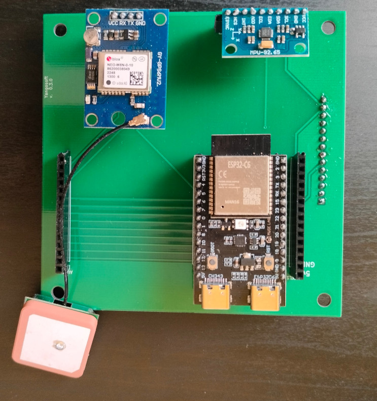
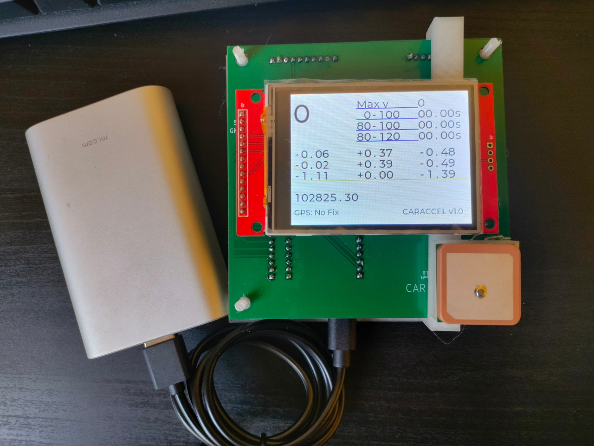
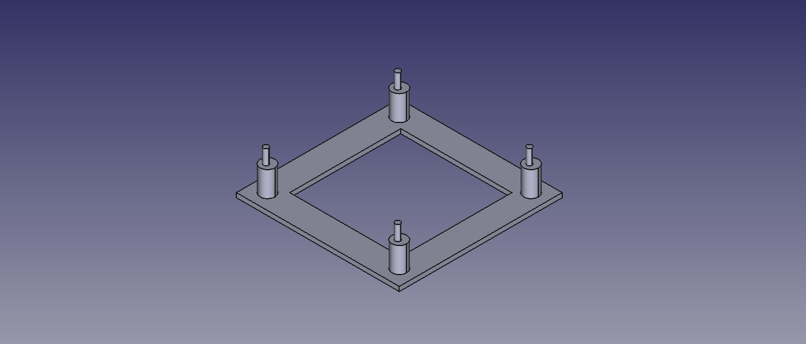
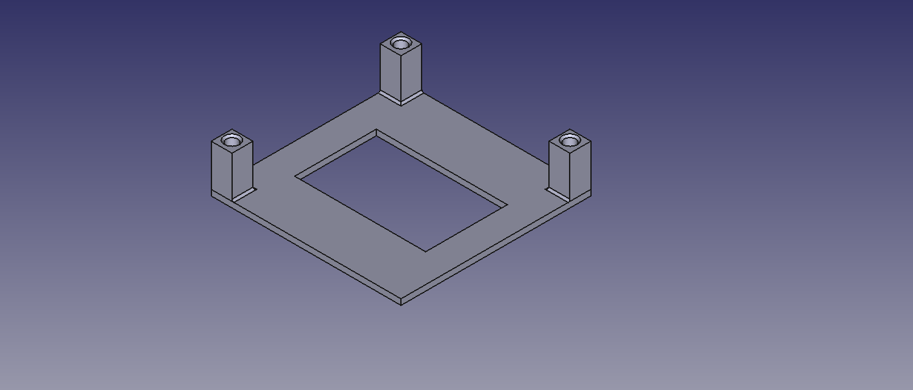
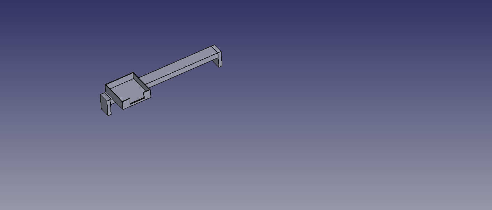

# caraccel

Simple ESP32 C6 with MPU9265 accelerometer and ublox GPS M8.

Android/iOS application to get timings.

2 versions:
- [Espressif IDF version using FreeRTOS and LVGL](caraccel-idf/)
- [App](app/CarAccel/)
- [Box](box/)
- [Arduino. Deprecated](src/)


Working PCB. Use Kicad 9.

[PCB version 0.3.0](pcb/caraccel2)












## ESP32
```
$ cd caraccel-idf/
$ idf.py build && idf.py flash
```

## App
```
$ cd app/CarAccel/
$ npm i
$ ionic build && npx cap sync android
```


